# Databricks Setup Guide

This guide explains the end-to-end setup for Databricks, from generating credentials and setting permissions to creating Unity Catalog objects and understanding where data and trained models appear inside the Databricks workspace.

---

## Setup Overview

To run the Silicon Labs MLOps SDK end-to-end, users must complete the following steps (need admin rights for steps 1-3):

1. **Identity Setup** – Create a Service Principal + Client Secret
2. **Workspace & Unity Catalog Permissions** – Catalogs, Schemas, Tables, and Volumes
3. **Unity Catalog Object Creation** – Catalog → Schema → Tables → Volumes
4. **Configuration** – Provide credentials to the CLI or Python API
5. **Data & Model Access** – Where ingested data and trained models appear

---

## 1. Create Required Credentials

The SDK connects to Databricks using:

- **Environment Variables (recommended)**
- **Programmatic configuration using `data.config()`**

You must generate:

- Service Principal
- Client Secret
- Client ID
- Workspace URL
- ZeroBus Endpoint

### 1.1 Create a Service Principal

1. Open Databricks workspace
2. Navigate to **Admin Settings → Service Principals**
3. Click **Add Service Principal**
4. Name it (e.g., `mlops-sp`)
5. Open the SP details page

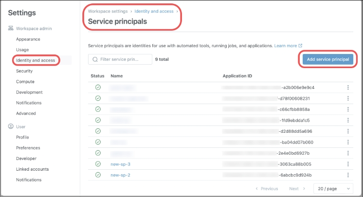

### 1.2 Generate a Client Secret

1. Inside the service principal, open **Secrets**
2. Click **Generate New Secret**
3. Copy the **Client ID** and **Client Secret**

_Note: The Client ID and Client Secret are required for authentication. Copy the client secret immediately as it will not be visible again._

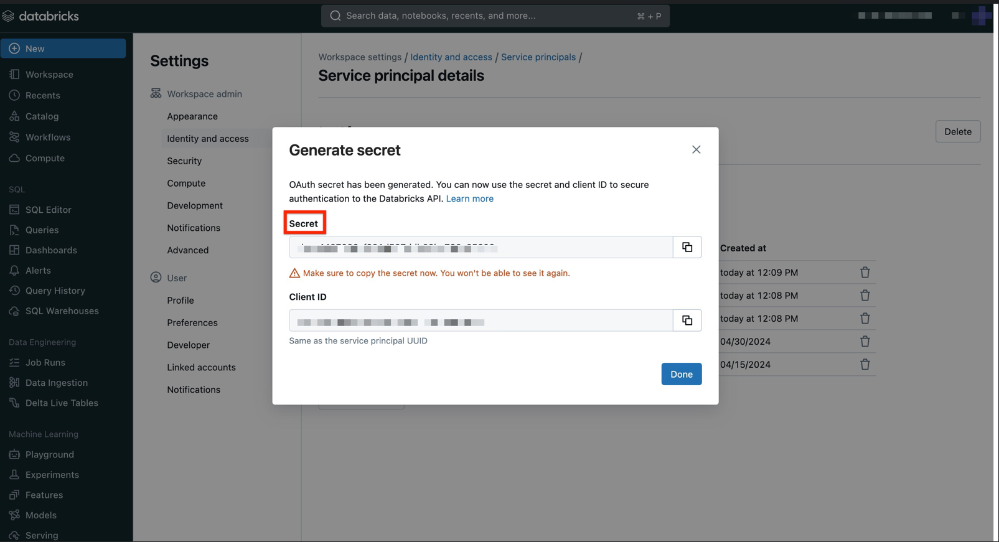

### 1.3 Fetch Workspace URL and ZeroBus Endpoint

To connect the Silicon Labs MLOps SDK to Databricks, you need two values:

**Workspace URL**

This is the base URL of your Databricks workspace.
You can copy it directly from your browser address bar when logged in.
Example format:

```
https://<workspace-name>.<region>.azuredatabricks.net
```

**ZeroBus Endpoint**

ZeroBus is region-based. Your workspace has a unique endpoint built using your workspace ID and region.
Example format:

```
https://<workspace-id>.zerobus.<region>.azuredatabricks.net
```

To find your workspace ID, look at the Databricks URL:

```
https://<workspace-url>/?o=<workspace-id>
```

Your workspace must be zerobus enabled and in a region supported by ZeroBus, and the connector appears only in those regions.

> **IMPORTANT:** For more details like how to fetch the Workspace URL and ZeroBus Endpoint refer [Databricks documentation](https://learn.microsoft.com/en-us/azure/databricks/ingestion/zerobus-ingest).

---

## 2. Assign Required Permissions

### 2.1 Workspace Permissions

1. Before proceeding, ensure that your Databricks account (or the group your account belongs to) has the required workspace entitlements enabled — specifically:
   - **Workspace access** → allows you to log into and use the Databricks workspace
   - **Databricks SQL access** → allows you to run SQL queries and access SQL Warehouses

You can verify these in **Admin Console → Groups → [Your Group] → Entitlements**.

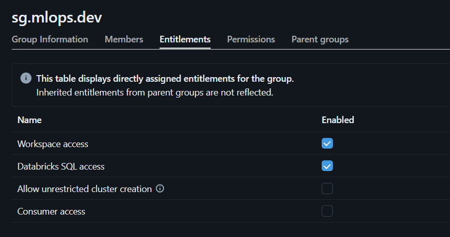

1. The workspace should be `zerobus enabled` to ingest data using ZeroBus. If it is not enabled the ingestion will fail.

#### Verify Zerobus Connector Availability

The Zerobus Ingest Connector should appear by default in your Databricks workspace under:
Add Data → Databricks Connectors → Zerobus Ingest

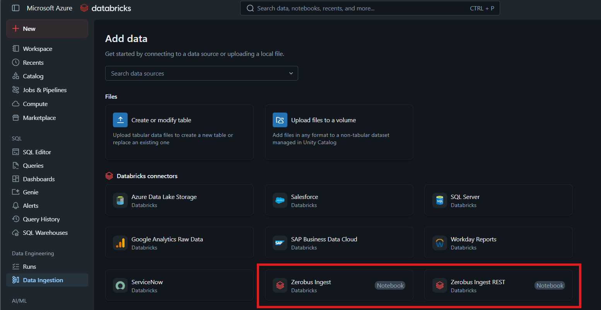

However, this connector only appears if:

    * Your workspace is deployed in a region where Zerobus is supported, and
    * Zerobus has been enabled by Databricks for your workspace

If the connector does not appear, check:

    * Your workspace region
    * Whether Zerobus has been enabled (contact your Databricks admin or Databricks support)

It's available in workspaces deployed in these regions - [Zerobus Ingest connector limitations](https://learn.microsoft.com/en-us/azure/databricks/ingestion/zerobus-ingest). For more details, refer to the official documentation of the [Zerobus Ingest connector](https://learn.microsoft.com/en-us/azure/databricks/ingestion/zerobus-ingest).

---

## 2.2 Unity Catalog Permissions

If you haven't created a catalog, schema, table, and volume, or if you want to create new ones, you can create them by following the steps in [Unity Catalog Object Creation](#3-unity-catalog-object-creation).

Unity Catalog permissions must be granted at:

- Catalog level
- Schema level
- Table level
- Volume level

### Catalog Level

```sql
GRANT USE CATALOG ON CATALOG <catalog> TO `<service-principal>`;
GRANT USE SCHEMA ON CATALOG <catalog> TO `<service-principal>`;
GRANT SELECT ON CATALOG <catalog> TO `<service-principal>`;
GRANT MODIFY ON CATALOG <catalog> TO `<service-principal>`;
GRANT CREATE TABLE ON CATALOG <catalog> TO `<service-principal>`;
```

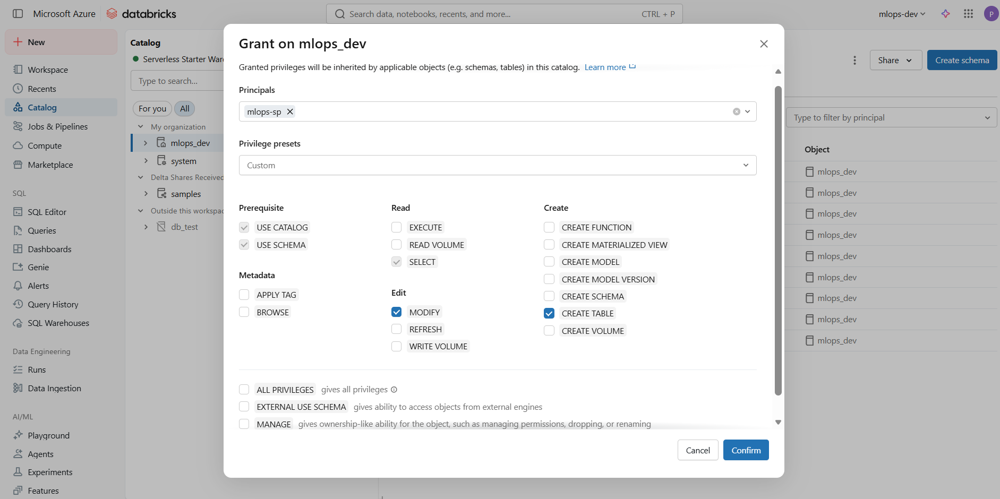

### Schema Level

```sql
GRANT USE SCHEMA ON SCHEMA <catalog>.<schema> TO `<service-principal>`;
GRANT SELECT ON SCHEMA <catalog>.<schema> TO `<service-principal>`;
GRANT MODIFY ON SCHEMA <catalog>.<schema> TO `<service-principal>`;
```

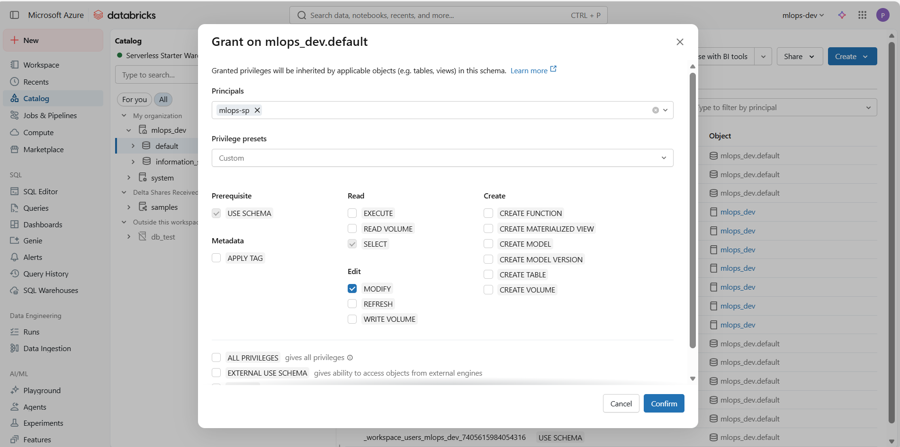

### Table Level

```sql
GRANT SELECT, MODIFY ON TABLE <catalog>.<schema>.<table> TO `<service-principal>`;
```

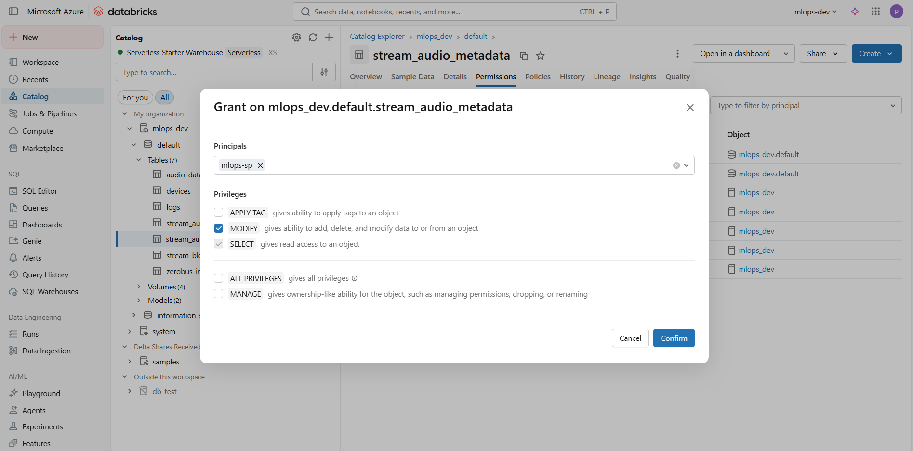

### Volume Level

```sql
GRANT READ, WRITE ON VOLUME <catalog>.<schema>.<volume> TO `<service-principal>`;
```

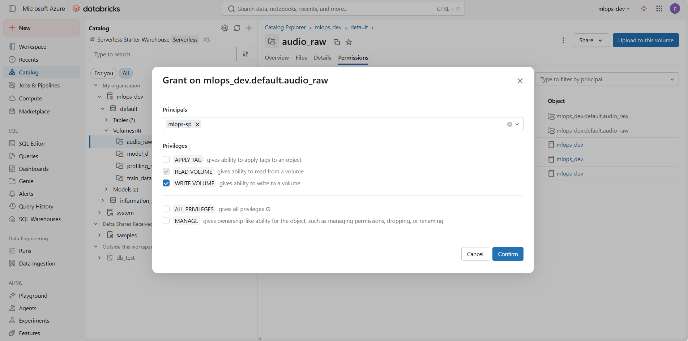

---

## 3. Create Catalog, Schema, Tables, and Volumes

### 3.1 Create a Catalog

_Note: Make sure your account has permission to create a catalog. If not, ask your admin to grant you permission._

1. Go to **Catalog Explorer**
2. Click **Create** button on the top right corner and select **Create Catalog**
3. Example: `mlops_catalog`

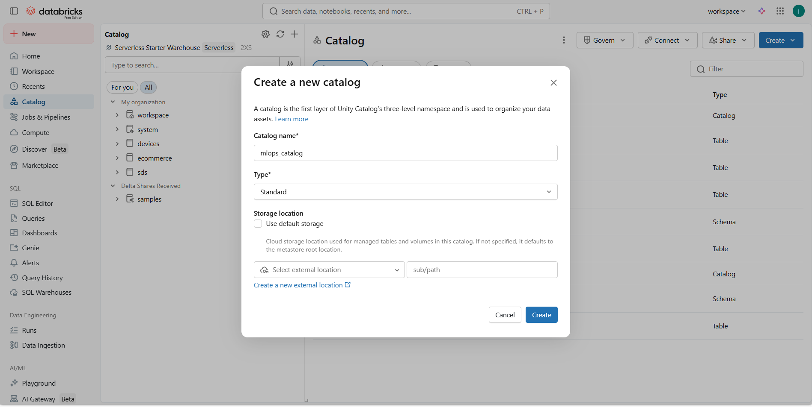

### 3.2 Create a Schema

1. Choose & click the Catalog you want the schema to be created in.
2. Inside your catalog, click **Create Schema** on the top right corner
3. Example: `sensor_data`

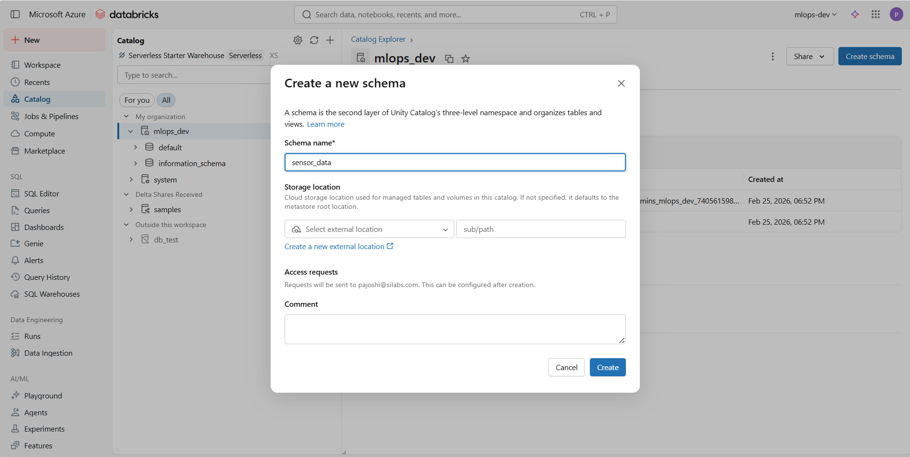

### 3.3 Create a Table

1. Go to **SQL Editor**
2. Click on **SQL Query** and run the following query in that new SQL Query tab:

```sql
CREATE TABLE IF NOT EXISTS mlops_catalog.sensor_data.readings (
  timestamp TIMESTAMP,
  device_id STRING,
  temperature DOUBLE,
  humidity DOUBLE
) USING DELTA;
```

Once you run the script & created the table, you can find the table in the Catalog Explorer under the schema you created it in.

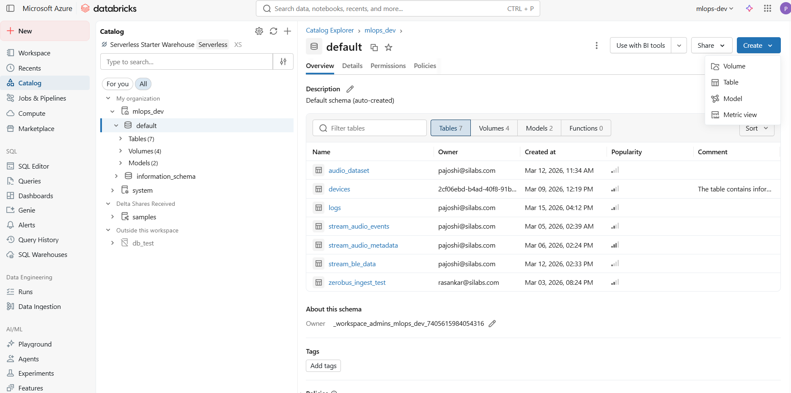

### 3.4 Create a Volume

1. Go to **Catalog Explorer**
2. Click **Create** button on the top right corner and select **Create Volume** and select the Catalog and Schema where you want to create the volume.
   Or else you can run this script in the SQL Editor

```sql
CREATE VOLUME mlops_catalog.default.artifacts;
```

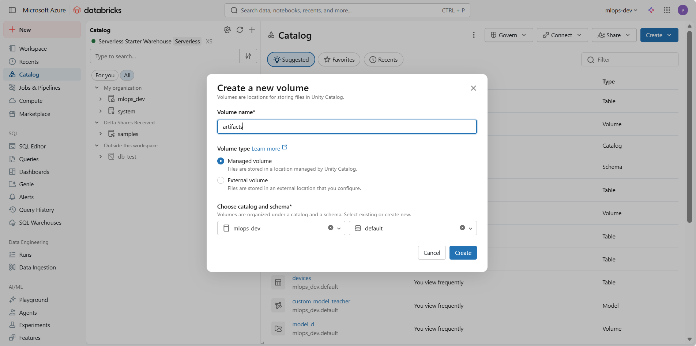

### How to View Your Created Objects

Once you have created your Catalog, Schema, or Table, you can always find them here:

1. On the left-hand sidebar of Databricks, click on **Catalog** (the cylinder icon).
2. Use the **Catalog Explorer** to browse your hierarchy:
    - **Catalogs**: Listed in the main pane.
    - **Schemas**: Found inside a selected Catalog.
    - **Tables**: Found inside a selected Schema under the "Tables" tab.
    - **Volumes**: Found inside a selected Schema under the "Volumes" tab.

Once created, ensure you provide your Service Principal with the necessary **GRANTs** (USE CATALOG, USE SCHEMA, SELECT, MODIFY) as described in the Permissions section.

---

## 4. Configure Credentials

Once you have got all the credentials and permissions, you can configure the credentials in the following ways:

### Option 1 — Environment Variables

Set **Environment Variables** on your system. The CLI will automatically fetch these whenever you run CLI commands like `sml ops ingest`.

Windows PowerShell:

```powershell
setx ZEROBUS_SERVER_ENDPOINT "your-endpoint"
setx ZEROBUS_WORKSPACE_URL "https://your-workspace"
setx ZEROBUS_TABLE_NAME "catalog.schema.table"
setx ZEROBUS_CLIENT_ID "your-id"
setx ZEROBUS_CLIENT_SECRET "your-secret"
```

Linux/macOS:

```bash
export ZEROBUS_SERVER_ENDPOINT="your-endpoint"
export ZEROBUS_WORKSPACE_URL="https://your-workspace"
export ZEROBUS_TABLE_NAME="catalog.schema.table"
export ZEROBUS_CLIENT_ID="your-id"
export ZEROBUS_CLIENT_SECRET="your-secret"
```

### Option 2 — Programmatic Configuration

If you are writing a Python script, you must call `data.config()` once at the startup. You can either pull from your environment variables or provide them directly.

#### Fetching from Environment Variables (Recommended)

```python
import os
from sml.ops import data

data.config(
    server_endpoint=os.getenv("ZEROBUS_SERVER_ENDPOINT"),
    workspace_url=os.getenv("ZEROBUS_WORKSPACE_URL"),
    table_name=os.getenv("ZEROBUS_TABLE_NAME"),
    client_id=os.getenv("ZEROBUS_CLIENT_ID"),
    client_secret=os.getenv("ZEROBUS_CLIENT_SECRET")
)
```

#### Direct Configuration

```python
from sml.ops import data

data.config(
    server_endpoint="your-zerobus-endpoint.databricks.com",
    workspace_url="https://your-workspace.databricks.com",
    table_name="catalog.schema.sensor_table",
    client_id="your-id",
    client_secret="your-secret"
)
```

#### Run the Ingestion and Model Pipeline

Once credentials are provided (via Environment Variables or programmatically using `data.config()`), users may run these tasks on the databricks workspace:

- Data ingestion
- Metadata writing
- Model training
- Model registration

---

## 5. Where Data & Models Appear in Databricks

### 5.1 View Data (Tables)

To view your raw data:

1. Go to **Catalog Explorer**.
2. Navigate to: **`<Your Catalog>`** → **`<Schema>`** → **`<Tables>`**.
3. Click on your table name.
4. Select the **Sample Data** tab to preview the records sent by the CLI.

Users can:

- Preview data
- Inspect schema
- Verify ingestion

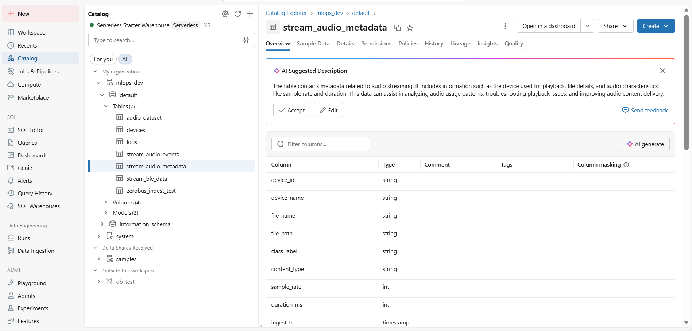

_Note: You can follow the same steps to view volumes and the data stored in those volumes. Navigate to: **`<Your Catalog>`** → **`<Schema>`** → **`<Volumes>`** ._

### 5.2 View Trained Models

### **Trained Model (Model Registry)**

To view your uploaded models:

1. Navigate to AI/ML section in the left sidebar.
2. Click on **Models** in the left sidebar.
3. Search for your model name to see:
    - Trained model versions
    - Metrics and Parameters

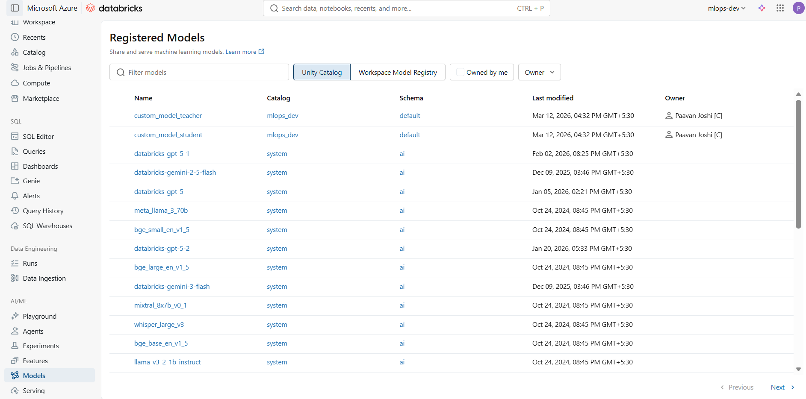

---
