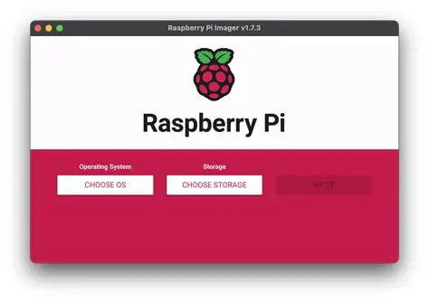
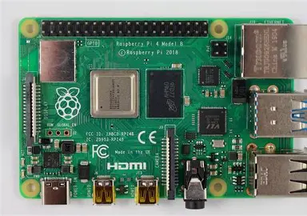

# Raspberry Pi Setup Guide

This guide explains how to prepare, flash, and connect to a Raspberry Pi using an SD card and a laptop.

***

## 1. Prepare the SD Card

1.  Take a microSD card (at least 8GB; 16GB or more recommended).
2.  If it has been used earlier, **format it** using any SD-card formatting tool.
3.  Insert the SD card into a **card reader** and connect it to your laptop.

***

## 2. Use Raspberry Pi Imager

1.  Download and open **Raspberry Pi Imager** (the official installer used to flash Pi images).



2.  Choose:
    *   **Device** → Select your Raspberry Pi model
    *   **OS** → Raspberry Pi OS or your preferred OS
    *   **Storage** → Select your SD card

3.  Before flashing, open the **Advanced Options** (gear icon). Configure the following:
    *   **Set Hostname** (e.g., `raspberrypi.local` or any custom name)
    *   **Enable SSH**
    *   **Set Username and Password**
    *   **Configure Wi‑Fi** (SSID, password, and region)
    *   **Set Locale/Timezone** if needed


**Important:** The user **must take note** of the username and password—write it down or take a photo. It will be required later.

4.  Click **Write** to flash the OS to the SD card.

***

## 3. Insert SD Card Into Raspberry Pi

1.  Once flashing completes, safely eject the SD card.
2.  Remove it from the card reader.
3.  Insert the SD card into the Raspberry Pi.
4.  Connect the Raspberry Pi to:
    *   Power
    *   A display (optional)
    *   Network (Wi‑Fi or Ethernet)

***



## 4. Find the Raspberry Pi’s IP Address

Once the Pi boots, obtain its IP address:

*   From your router’s device list, or
*   Using a network scanner tool like `Advanced IP Scanner` or `nmap`

***

## 5. Connect via SSH

From your local laptop, run:

```sh
ssh username@<raspberry_pi_ip>
```

Replace:

*   `username` → the one set during flashing
*   `<raspberry_pi_ip>` → the IP address you found

You will be asked for the **password** you configured earlier.

If the login works, your Raspberry Pi is successfully flashed and connected!

***

## ✔ Success

You have now:

*   Prepared the SD card
*   Flashed Raspberry Pi OS
*   Configured Wi‑Fi, SSH, hostname, username, and password
*   Booted the Pi
*   Connected over SSH

Your Raspberry Pi setup is complete.

***

