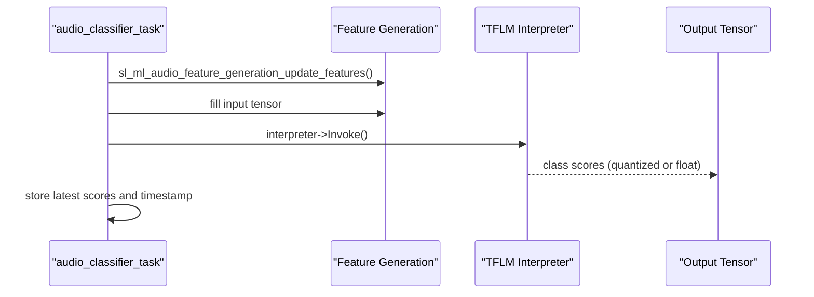
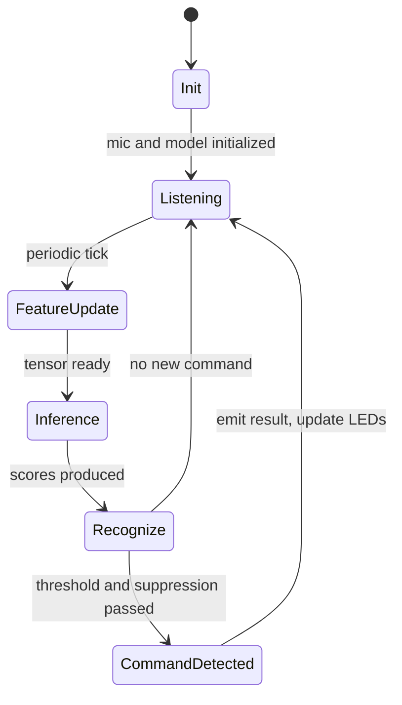

# AI/ML Audio Classifier MicriumOS - Complete Flow

This document explains the full behavior of `aiml_soc_audio_classifier_efr32_micriumos`:

- board/platform startup
- MicriumOS task model
- microphone capture to feature extraction
- TensorFlow Lite Micro inference pipeline
- command recognition (smoothing + threshold + suppression)
- where voice-derived data becomes usable output

---

## 1) High-Level Architecture

```mermaid
flowchart LR
    A["Mic I2S and DMA"] --> B["Audio ring buffer"]
    B --> C["Feature generation update"]
    C --> D["Feature slices spectrogram"]
    D --> E["Fill TFLM input tensor"]
    E --> F["Invoke model"]
    F --> G["Scores per class"]
    G --> H["RecognizeCommands smoothing"]
    H --> I["New command decision"]
    I --> J["handle_result class label score time"]
```



---

## 2) Startup and Board Initialization

`main.c` startup is the same `sl_main` pattern:

1. `sl_main_second_stage_init()`
2. `app_init()`
3. optional task loop

`app.c` does the app-level startup:

- `app_init()` calls `audio_classifier_init()`

Board/platform init still comes from autogenerated stack/platform handlers (`sl_platform_init`, `sl_driver_init`, `sl_service_init`, `sl_stack_init`) before classifier init runs.

---

## 3) Runtime OS Model (MicriumOS)

Unlike the BLE thermometer app (FreeRTOS), this app uses MicriumOS task primitives:

- task creation: `OSTaskCreate(...)`
- periodic delay: `OSTimeDlyHMSM(...)`
- kernel objects/state managed by MicriumOS APIs

`audio_classifier_init()` creates `audio_classifier_task`.

Task loop cadence:

1. sleep for `INFERENCE_INTERVAL_MS`
2. update audio features
3. run inference
4. process recognition output

---

## 4) Audio Capture and Feature Pipeline

## 4.1 Microphone capture

The I2S mic driver streams PCM audio using DMA and a callback path. Audio blocks are pushed into the ML audio frontend ring buffer.

## 4.2 Feature extraction (`sl_ml_audio_feature_generation`)

The frontend performs:

- windowing/FFT
- mel filterbank projection
- noise reduction
- PCAN/gain control
- log scaling

Output becomes feature slices suitable for the model input tensor.

## 4.3 Tensor fill

Before inference, feature data is quantized/scaled and copied into the model input tensor using ML helper APIs.

---

## 5) TFLM Initialization and Inference

`audio_classifier_init()` sets up:

- model pointer (`sl_tflite_model_array`)
- `MicroInterpreter`
- op resolver
- tensor arena
- input and output tensor pointers

`run_inference()` flow:



---

## 6) Recognition Logic (why logs look stable)

Raw model output is not used directly as a command. `RecognizeCommands` applies post-processing:

- time-window averaging over previous results
- detection threshold check
- suppression interval after a trigger
- minimum sample count/time consistency

This avoids noisy toggling and false positives.

So:

- many inference prints can occur without trigger
- trigger appears only when averaged confidence crosses threshold and suppression allows a new event

---

## 7) Main Decision Hook: `handle_result(...)`

`handle_result(current_time, result, score, is_new_command)` is the best abstraction boundary for downstream transport (for example BLE transmission later).

When `is_new_command == true`, the app already has:

- `result` (class index)
- `label` (mapped class string)
- `score` (confidence)
- `current_time` (ms timestamp)

Current local actions:

- print detection log
- update detection/activity LEDs
- set suppression timeout

This is where to package voice-derived data for remote transport in the future merge.

---

## 8) End-to-End State Diagram



---

## 9) Data-Path Pseudocode (code-oriented view)

```cpp
void audio_classifier_task(void*) {
  while (true) {
    sleep_ms(INFERENCE_INTERVAL_MS);

    sl_ml_audio_feature_generation_update_features();
    fill_input_tensor_from_features();

    interpreter->Invoke();
    auto scores = read_output_scores();

    bool is_new_command = recognizer.ProcessLatestResults(scores, now_ms, &result, &score);
    handle_result(now_ms, result, score, is_new_command);
  }
}
```

---

## 10) Important Integration Notes (for future merge)

- This project currently has no Bluetooth component in its component catalog.
- It is MicriumOS-based and targets EFR32MG26 board configuration.
- The clean exported "semantic event" is in `handle_result(...)`.
- Microphone/audio frontend and TFLM must keep their periodic timing budget.
- Any transport layer (BLE later) should avoid blocking this inference loop.

