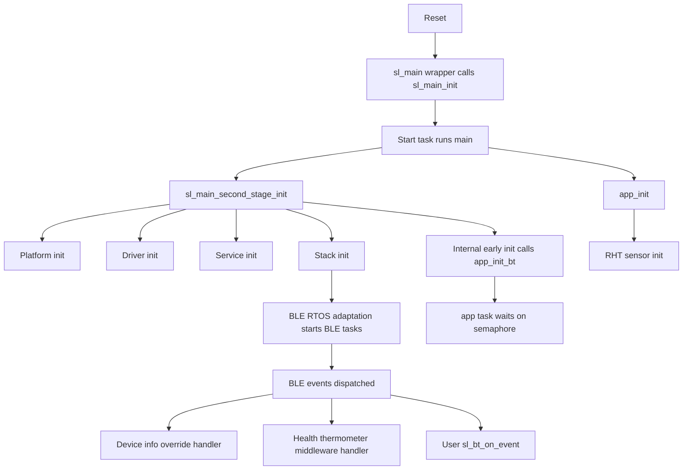
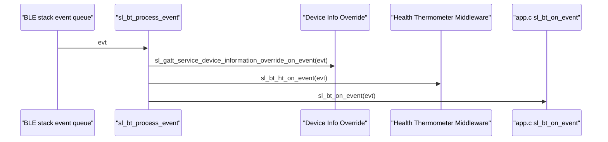
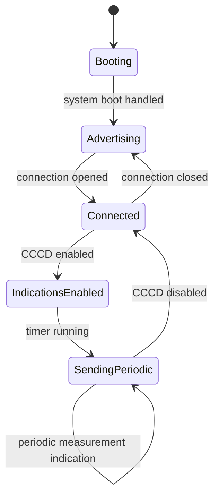

# Bluetooth Thermometer MicriumOS - Complete Flow

This document explains the full runtime behavior of `bt_soc_thermometer_micriumos`:

- board/platform initialization
- RTOS and Bluetooth task model
- advertising and connection flow
- device name configuration
- GATT database and characteristic behavior
- event dispatch and app callbacks

---

## 1) High-Level Architecture (`bt_soc_thermometer_micriumos`)

---

## 2) Startup and Board Initialization

## 2.1 Entry and second-stage init

`main.c` calls:

1. `sl_main_second_stage_init()`
2. `app_init()`
3. optional loop controlled by `sl_main_start_task_should_continue()`

In this project, the startup wrapper calls `sl_main_init()` and kernel startup before your `main()` executes in the start task context.

## 2.2 What `sl_main_second_stage_init()` does

Order:

1. `sl_platform_init()`
2. `sl_driver_init()`
3. `sl_service_init()`
4. `app_init_post_platform()`
5. `sl_stack_init()`
6. `sl_internal_app_init()`

## 2.3 Board and platform details in this project

From `autogen/sl_event_handler.c`:

- `sl_platform_init()`:
  - `sl_board_preinit()`
  - clock manager runtime init
  - HFXO hardware init
  - `sl_board_init()`
  - `CPU_Init()` (Micrium core init)
  - NVM3 default init

- `sli_internal_init_early()`:
  - `app_init_bt()` (creates app task/semaphore/mutex)

- `sl_driver_init()`:
  - SWO debug init
  - GPIO init
  - I2C sensor instance init
  - button instances init
  - Co-processor transport send config

- `sl_service_init()`:
  - VCOM configure
  - HFXO manager init
  - iostream init
  - mbedTLS + PSA + SE crypto init
  - CLI init

---

## 3) MicriumOS + BLE RTOS Configuration

## 3.1 App tasking layer (`app_micriumos.c`)

`app_micriumos.c` creates:

- `app_task` (priority 31, stack 1024 bytes)
- an `OS_SEM` for process scheduling
- an `OS_MUTEX` (allocated from memory manager) for shared-state guard

`app_process_action()` blocks until `app_proceed()` posts the semaphore.

## 3.2 BLE RTOS adaptation tasking

The Bluetooth host adaptation creates dedicated tasks (configured in `config/sl_bt_rtos_config_s2.h`):

- Link Layer task: priority 52, stack 1000 bytes
- Host Stack task: priority 51, stack 2000 bytes
- Event Handler task: priority 50, stack 1000 bytes

This is why BLE event processing does not run in a bare-metal polling loop.

## 3.3 BLE stack runtime flags

`config/sl_bluetooth_config.h` sets:

- RTOS mode via `SL_BT_CONFIG_FLAG_RTOS`
- buffer/timer/tx-power defaults
- `gattdb` binding to generated DB (`.gattdb = &gattdb`)

---

## 4) BLE Event Dispatch Chain

All events pass through `sl_bt_process_event()`:

This ordering matters during boot because each handler performs initialization.

---

## 5) Device Name Configuration

Device name is generated from GATT config:

- file: `bt_soc_thermometer_micriumos/config/btconf/gatt_configuration.btconf`
- characteristic: GAP Device Name (UUID `0x2A00`)
- default value: `"Thermometer Example"`

Generated output:

- handle symbol `gattdb_device_name` in `bt_soc_thermometer_micriumos/autogen/gatt_db.h`
- value bytes in `bt_soc_thermometer_micriumos/autogen/gatt_db.c`

The characteristic is configured read/write, so a client can update it at runtime.

---

## 6) GATT Database Composition

Primary database source files:

- `bt_soc_thermometer_micriumos/config/btconf/gatt_configuration.btconf`
  - Generic Access
  - Device Information
- `bt_soc_thermometer_micriumos/config/btconf/health_thermometer.xml`
  - Health Thermometer service
  - Temperature Measurement (indicate)
  - Temperature Type (read)
  - Intermediate Temperature (notify)
  - Measurement Interval (+ descriptors)

Generated files:

- `bt_soc_thermometer_micriumos/autogen/gatt_db.h` (handles + lengths)
- `bt_soc_thermometer_micriumos/autogen/gatt_db.c` (full attribute table)

---

## 7) Thermometer Runtime Behavior

## 7.1 Boot behavior

On `sl_bt_evt_system_boot_id` in `bt_soc_thermometer_micriumos/app.c`:

1. print stack version and address
2. create advertising set
3. generate advertising payload
4. set interval to 100 ms
5. start connectable advertising

## 7.2 Connection behavior

- `connection_opened`: logs open, optional power reporting
- `connection_closed`: restart advertising immediately

## 7.3 Indication enable/disable flow

The middleware catches CCCD changes for `temperature_measurement` and calls app override callback:

- `sl_bt_ht_temperature_measurement_indication_changed_cb(...)`

App callback behavior:

- if enabled:
  - start periodic timer (`SL_BT_HT_MEASUREMENT_INTERVAL_SEC * 1000`)
  - send first indication immediately
- if disabled:
  - stop periodic timer

## 7.4 Periodic send path

Timer callback:

1. read humidity/temperature from `sl_sensor_rht_get(...)`
2. if button0 pressed, override temp to `-20C`
3. send indication using:
   - `sl_bt_ht_temperature_measurement_indicate(connection, temperature, false)`

## 7.5 App process trigger model

Even though `app_process_action()` currently has no extra workload, the synchronization path is active:

- `app_proceed()` posts semaphore
- app task wakes
- `app_is_process_required()` returns true once event consumed
- app callback body executes non-blocking logic

---

## 8) Device Information Override Component

`sl_gatt_service_device_information_override.c` updates Device Information chars on boot:

- firmware revision string
- model number
- hardware revision
- system ID (derived from BLE address)

This is separate from your app event handler but in the same event chain.

---

## 9) End-to-End State Diagram

---

## 10) What changed vs FreeRTOS variant

- This project uses `micriumos_kernel` instead of `freertos`.
- App helper file is `app_micriumos.c` (not `app_freertos.c`).
- `sli_internal_init_early()` wires `app_init_bt()` before normal app init.
- Board and device align with AI app (`brd2608a`, `EFR32MG26...`).
- SDK version aligns with AI app (`2025.12.1`), reducing integration churn.

---

## 11) Important Integration Notes (for future merge)

- BLE events are centralized through `sl_bt_process_event()`.
- User BLE logic is in `app.c::sl_bt_on_event()`.
- Thermometer periodic send hook is `app_periodic_timer_cb(...)`.
- Device name source of truth is `.btconf` + generated `gatt_db`.
- This app uses MicriumOS kernel plus BLE RTOS adaptation tasks.

