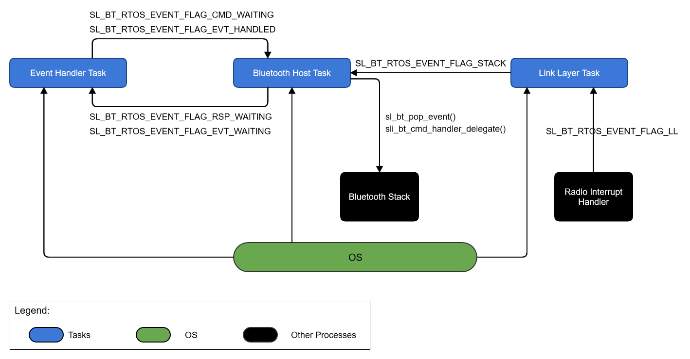

# SoC - Thermometer RTOS

This example application demonstrates the integration of a Real Time Operating System (RTOS) into Bluetooth applications. RTOS is added to the **Bluetooth - SoC Thermometer** example.

> Note: This example does not include Device Firmware Update (DFU) functionality by default. For details see the [Device Firmware Update](#device-firmware-update) section.

## Getting Started

To get started with Silicon Labs Bluetooth and Simplicity Studio, see [QSG169: Bluetooth SDK v3.x Quick Start Guide](https://www.silabs.com/documents/public/quick-start-guides/qsg169-bluetooth-sdk-v3x-quick-start-guide.pdf).

To learn more about how the thermometer example application works, create a **SoC - Thermometer** example project (without RTOS).

## Bluetooth over RTOS

The following image shows the system architecture of an RTOS based Bluetooth application. The Bluetooth stack is run in multiple tasks:
- Link Layer Task signals Bluetooth Host Task when the Bluetooth stack needs an update.
- Bluetooth Host Task updates the Bluetooth stack, issues stack events to Event Handler Task and handles commands from application tasks.
- Event Handler Task handles and dispatches stack events to `sl_bt_on_event()` that needs to be integrated in the application.

To learn more about RTOS integration into Bluetooth projects, see [AN1260: Integrating v3.x Silicon Labs Bluetooth Applications with Real-Time Operating Systems](https://www.silabs.com/documents/public/application-notes/an1260-integrating-v3x-bluetooth-applications-with-rtos.pdf).

## Device Firmware Update

This example project does not include Device Firmware Update (DFU) functionality by default, but it can be added easily.
SoC applications can use one of Silicon Labs' Over-the-Air (OTA) DFU implementations. The table below summarizes the options:

|                           | In-place OTA DFU                 | Application OTA DFU                 |
|---------------------------|----------------------------------|-------------------------------------|
| **Component to add**      | In-place OTA DFU                 | Application OTA DFU                 |
| **Compatible bootloader** | Bluetooth Apploader OTA DFU      | Bootloader - SoC Internal Storage (Series 2)   Bootloader - SoC Storage (Series 3) |
| **Reference solution**    | Bluetooth - SoC In-Place OTA DFU | Bluetooth - SoC Application OTA DFU |
| **Supported devices**     | Supports Series 2 devices only and requires a smaller flash size | Supports Series 2 and Series 3 devices with enough flash to store firmware images in 2 instances |

To add DFU to an existing project:
- Add the appropriate DFU component to your project using Simplicity Studio’s Software Component browser.
- Add a post-build step to generate the GBL (Gecko Bootloader) file using Simplicity Studio’s Post Build Editor.
- Rebuild the project.
- Flash a compatible bootloader to the device.

For more information on bootloaders, see [UG103.6: Bootloader Fundamentals](https://www.silabs.com/documents/public/user-guides/ug103-06-fundamentals-bootloading.pdf) and [UG489: Silicon Labs Gecko Bootloader User's Guide for GSDK 4.0 and Higher](https://www.silabs.com/documents/public/user-guides/ug489-gecko-bootloader-user-guide-gsdk-4.pdf).

## Troubleshooting

### Programming the Radio Board

Before programming the radio board mounted on the mainboard, make sure the power supply switch is in the AEM position (right side) as shown below.

## Resources

[Bluetooth Documentation](https://docs.silabs.com/bluetooth/latest/)

[UG103.14: Bluetooth LE Fundamentals](https://www.silabs.com/documents/public/user-guides/ug103-14-fundamentals-ble.pdf)

[QSG169: Bluetooth SDK v3.x Quick Start Guide](https://www.silabs.com/documents/public/quick-start-guides/qsg169-bluetooth-sdk-v3x-quick-start-guide.pdf)

[UG434: Silicon Labs Bluetooth ® C Application Developer's Guide for SDK v3.x](https://www.silabs.com/documents/public/user-guides/ug434-bluetooth-c-soc-dev-guide-sdk-v3x.pdf)

[Bluetooth Training](https://www.silabs.com/support/training/bluetooth)

## Report Bugs & Get Support

You are always encouraged and welcome to report any issues you found to us via [Silicon Labs Community](https://www.silabs.com/community).